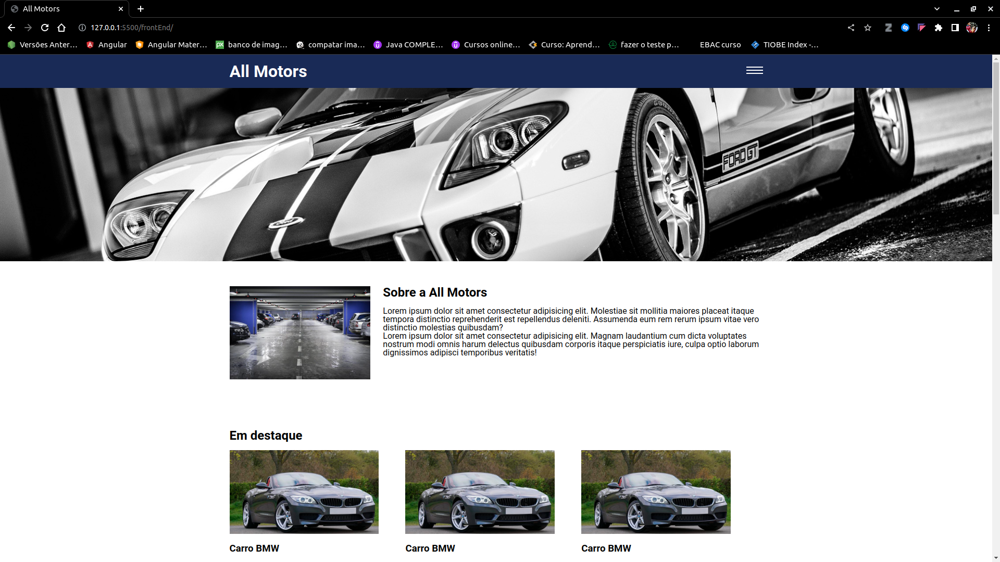
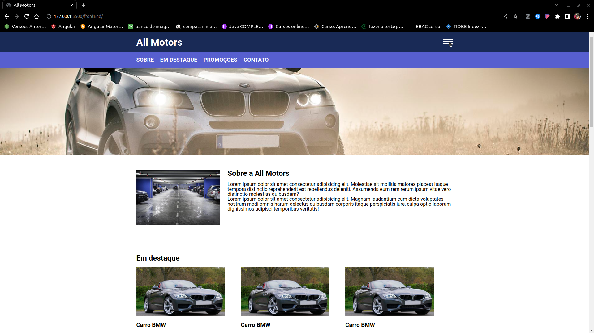
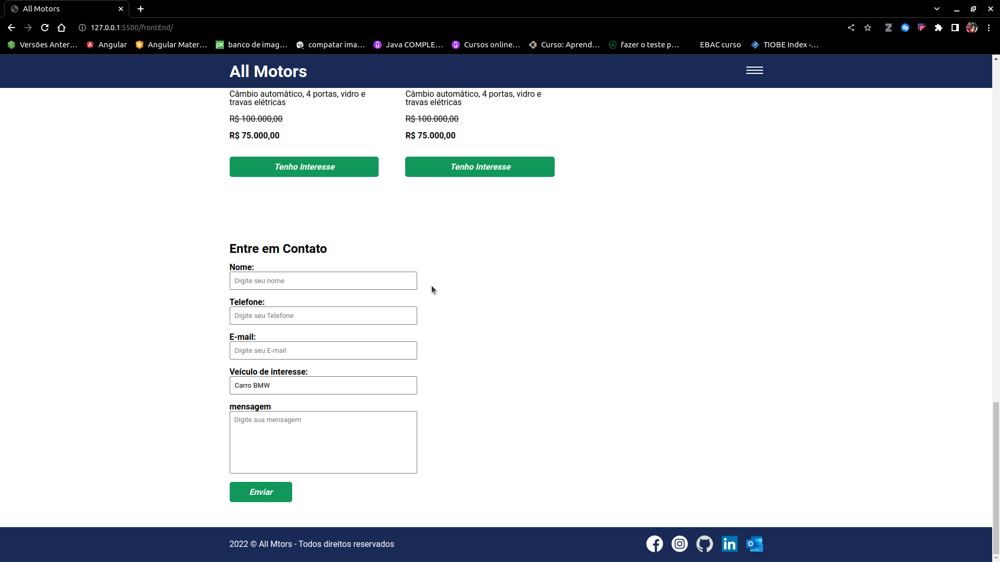

# aplicação web para um loja de carros nome da aplicação All Motors
### Licença vinculada ao repositório: 

#
### Tecnologias utilizadas: 

 
    
    
    
     

#

### Explicando o projeto:

1. No cabeçalho da aplicação podemos ver um menu do tipo sandwich, ao clicar nele aparece  algumas anternativas de menu. veja nas imagens a seguir: 
    
    - Clicando no menu:
    
2. Ao clicar em um carro que goste a pagina vai te direcionar ao formulario e vai preencher-lo automaticamente o campo de entrada do nome do carro, com o nome do carro em que você clicou.
    
    

# [Clique Aqui para ver a aplicação web](https://all-motors.vercel.app/)